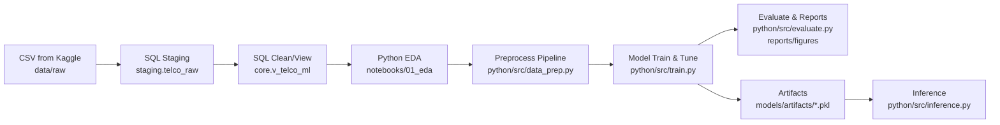

# Customer Churn Prediction (Telco) — SQL + Python

## TL;DR
پروژه پیش‌بینی **خروج مشتری (Churn)** برای شرکت مخابراتی فرضی. هدف: **شناسایی زودهنگام مشتریان در معرض خروج** تا تیم مارکتینگ بتواند کمپین نگهداشت اجرا کند. متریک اصلی: **PR-AUC** و **Recall@Top-k** به‌دلیل عدم‌توازن برچسب.

---

## معماری پروژه



```
.
customer_churn_prediction/
├─ data/
│  ├─ raw/                       # CSV اصلی کگل (فقط read-only داخل گیت)
│  ├─ interim/                   # خروجی‌های میانی پاک‌پذیر
│  └─ processed/                 # دیتای تمیز نهایی برای مدل
│
├─ sql/
│  ├─ 00_create_schemas.sql      # ساخت اسکیماها (staging, core)
│  ├─ 01_create_tables.sql       # جداول staging/core
│  ├─ 02_bulk_load_telco.sql     # BULK INSERT/OPENROWSET
│  ├─ 03_profiling_checks.sql    # nulls, cardinality, label ratio
│  └─ 99_views_features.sql      # (اختیاری) ویوهای آماده فیچر
│
├─ python/
│  ├─ notebooks/
│  │  ├─ 01_eda.ipynb
│  │  └─ 02_modeling.ipynb
│  └─ src/
│     ├─ __init__.py
│     ├─ data_prep.py            # load/clean/split + ColumnTransformer
│     ├─ train.py                # fit + save model & metrics
│     ├─ evaluate.py             # گزارش متریک‌ها + نمودارها
│     ├─ inference.py            # پیش‌بینی روی ورودی جدید
│     ├─ utils_io.py             # I/O و لاگ‌ها
│     └─ paths.py                # مدیریت مسیرها از config.yaml
│
├─ models/
│  ├─ artifacts/                 # pipeline.pkl, encoder.pkl, best_model.pkl
│  └─ reports.json               # متریک‌ها/هایپرها (ماشین‌خوان)
│
├─ reports/
│  ├─ figures/                   # pr_curve.png, cm.png, shap.png
│  ├─ summary.pdf                # گزارش یک‌صفحه‌ای
│  └─ medium_assets/             # تصاویر مقاله
│
├─ scripts/
│  ├─ run_all.bat                # برای ویندوز
│  └─ run_all.sh                 # برای bash
│
├─ tests/
│  ├─ test_data_prep.py          # تست حداقلی روی shape/nulls
│  └─ test_train.py              # smoke-test روی یک اساب‌ست
│
└─ .github/
 
```

