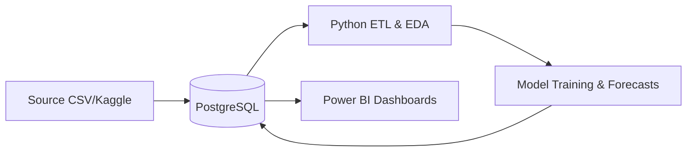

# Home Energy Analytics — کاهش قبض برق با تحلیل داده‌

> تحلیل و پیش‌بینی مصرف برق خانگی با SQL + Python + Power BI
> 

پاکسازی داده‌ها و ساخت یک دیتابیس تمیز (SQL Server)

تحلیل الگوها و شبیه‌سازی سناریوهای کاهش مصرف (Python)

ساخت داشبورد مدیریتی با قابلیت تغییر پارامترها و دیدن اثر روی قبض برق (Power BI)

## معماری

#energy-optimization/
├─ data/
│  ├─ raw/           # فایل خام مصرف انرژی
│  ├─ processed/     # خروجی‌های تمیز SQL/Python
├─ sql/
│  ├─ staging/       # کوئری‌های استیجینگ
│  ├─ warehouse/     # مدل ستاره‌ای
│  ├─ views/         # KPI Views
├─ python/
│  ├─ config.yaml    # مسیرها، پارامترها، تعرفه‌ها
│  ├─ features.py    # ساخت فیچرها
│  ├─ scenarios.py   # سناریوسازی کاهش مصرف
├─ notebooks/
│  ├─ 01_eda.ipynb   # تحلیل اکتشافی
├─ reports/
│  ├─ figures/       # نمودارها برای مقاله Medium
├─ powerbi/
│  └─ dashboard.pbix
├─ README.md
